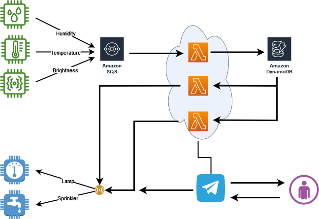

# Domotic Garden - Farming at home

<p align="center">
    
</p>

### 💡 Idea and reason

Over the years I have always tried to grow plants (chilli, salad, basil, etc.). I have noticed that this idea is very difficult to realise 😴, for various reasons: little space, little green thumb, but the biggest problem is lack of time. 
The **DOMOTIC GARDEN 🎍** could solve this problem!

My idea is to create a small greenhouse, capable of reproducing a functional ecosystem for the growth of different plants. With the use of sensors, placed in the greenhouse, I want to retrieve the parameters of the plants.
With these sensors I can monitor:

* 🌡Temperature (thermostat);
* ☀ Light Intensity (Luminosity);
* 💧 Soil moisture (Soil moisture).

After collecting this data, the idea is to activate other sensors, placed inside the greenhouse.
The sensors inside the greenhouse are:

* 💡 Lamp;
* ⛲ Sprinkler;

These sensors are activated for a specific purpose, based on certain information about the cultivation of pot plants.
on the cultivation of pot plants.

#### 🎈 How does it work?

Sensors, placed inside the small balcony greenhouse, collect data and send it to a queue. The data will be routed to two lambda functions: the first function will take care of storing the data in DynamoDB, the second will take care of sending the data, via telegram channel(or bot), to the end user. In addition, this function can activate/deactivate the output sensors by capturing a particular state of the data.

Clone repository:
```bash
https://github.com/GiuseppeDiPalma/DomoticGarden
```

Run [localStack](https://localstack.cloud/):
```bash
docker run --rm -it -p 4566:4566 -p 4571:4571 localstack/localstack
```

Start Telegram bot:
```python
python settings/telegram-bot/telegramBot.py
```

On bot [telegramBot](https://t.me/domoticgarden_bot) start, in case it was already started give **/start**

Upload lambda function and test it:
```bash
./startAWSres.sh
```

#### This is a view of the general infrastructure

<p align="center">
    
</p>

#### 🧰 Toolbox

* 3-input sensors for plant;
* 2-actuator sensors for plant;
* Amazon SQS to collect and distribute data;
* Telegram bot for monitor and run real-time lambda.

##### 🕵️‍♂️ Implementation details

**Lambda functions**

- _**activeMonitoring**_: It randomly generates data (taken from the sensors on the plants), then publishes a message on the queue of the sensor.
- _**passDataInDynamo**_: Reads messages from the queue(s) and adds data to the dynamodb.
- _**activeOutputSensor**_: It reads data from the dynamodb and decides whether to activate the actuators.
- _**switchOffActuator**_: Switches actuators off according to duration.
